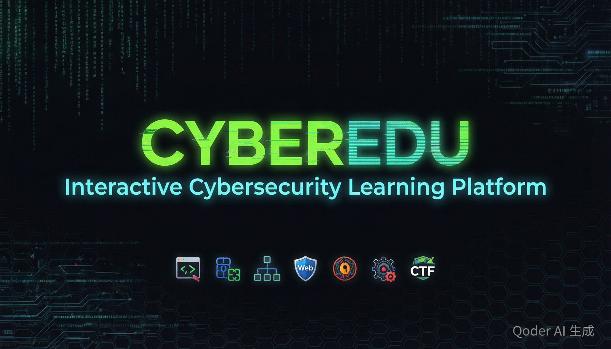
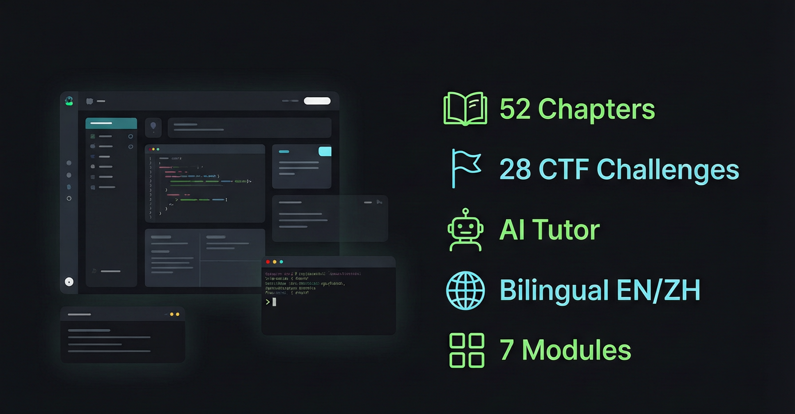

<p align="center">
  
</p>

<h1 align="center">CyberEdu — Cybersecurity Learning Platform</h1>

<p align="center">
  An interactive cybersecurity learning website — from absolute beginner to advanced practitioner.<br>
  <strong>52 chapters · 28 CTF challenges · Bilingual EN/ZH · AI Tutor</strong>
</p>

<p align="center">
  
  
  
  
  
  
</p>

<p align="center">
  <a href="https://chhhhhhhhhhhhhhh.github.io/cyberedu/">🚀 Live Demo</a>
  &nbsp;·&nbsp;
  <a href="README_zh.md">中文</a>
  &nbsp;·&nbsp;
  <a href="versions/CHANGELOG.md">Changelog</a>
  &nbsp;·&nbsp;
  <a href="https://github.com/Chhhhhhhhhhhhhhh/cyberedu/issues/new/choose">Report Bug</a>
</p>

---

## ✨ Features

<p align="center">
  
</p>

| Category | Details |
|----------|---------|
| 📚 **Content** | 52 chapters across 7 modules · 4 difficulty tiers (Beginner → Expert) |
| 🌐 **Bilingual** | Full EN/ZH translation · one-click UI language switch |
| 🤖 **AI Tutor** | Built-in chat assistant · streaming SSE · supports DeepSeek, OpenAI, Qwen, Claude, Ollama |
| 💻 **Code Editor** | CodeMirror 5 · Python / JS / C / Bash syntax highlighting |
| 🚩 **CTF Arena** | 16 challenges · Crypto, Web, Misc, Reverse, Forensics, PWN |
| ⌨️ **Practice** | 10 coding challenges with expected output validation |
| 🔍 **Search** | Ctrl+K global search · token-based fuzzy matching |
| 📱 **Responsive** | Full mobile support · sidebar overlay · compact navigation |
| 🌙 **Themes** | Dark / Light mode · persisted to localStorage |
| 📊 **Progress** | Auto-tracked learning progress · JSON export/import backup |

### 📚 7 Core Modules

```
Programming · Cryptography · Networking · Web Security · Pentesting · Malware Analysis · CTF
```

## 🏗️ Project Structure

```
cyberedu/
├── cyberedu.html          # Main page (entry point)
├── content.js             # Content data (bilingual: modules/chapters/exercises/CTF)
├── script.js              # Interactive logic
├── style.css              # Stylesheet (Neo-Brutalist Terminal design)
├── i18n.js                # EN/ZH localization (~140 translation pairs)
├── server.js              # Local Node.js server (AI chat proxy)
├── favicon.svg            # Site icon
├── docs/                  # Documentation assets (screenshots, OG images)
├── versions/              # Historical version archives + CHANGELOG
├── .github/               # Issue & feature request templates
└── CONTRIBUTING.md        # Contribution guidelines
```

## 🚀 Getting Started

### Quick Start (no server needed)

Just open `cyberedu.html` directly in your browser. Code highlighting, theme switching, progress tracking, and search — all work without a server.

### With AI Tutor (local server)

Requires [Node.js](https://nodejs.org/) v16+:

```bash
node server.js
# Then open http://localhost:8000
```

Click the green floating button (bottom-right) to open the AI chat panel. Click ⚙ to configure:

| Field | Example |
|-------|---------|
| API Type | `OpenAI Compatible` or `Anthropic` |
| API Base URL | `https://api.deepseek.com` |
| API Key | `sk-...` |
| Model | `deepseek-chat`, `deepseek-reasoner`, `claude-sonnet-4-20250514` |

Optional: adjust temperature, max tokens, and thinking/reasoning mode.

> 💡 On Windows, double-click `restart_server.bat` to restart the server.

## 🤖 Supported AI Models

| Provider | API Base URL | Model Examples |
|----------|-------------|--------|
| **OpenAI Compatible** |||
| DeepSeek | `https://api.deepseek.com` | `deepseek-chat`, `deepseek-reasoner` |
| OpenAI | `https://api.openai.com/v1` | `gpt-4o`, `gpt-4o-mini` |
| Qwen (Tongyi) | `https://dashscope.aliyuncs.com/compatible-mode/v1` | `qwen-plus`, `qwen-max` |
| Ollama (local) | `http://localhost:11434` | `llama3`, `qwen2` |
| Groq | `https://api.groq.com/openai/v1` | `llama-3.1-70b` |
| **Anthropic** |||
| Claude | `https://api.anthropic.com` | `claude-sonnet-4-20250514`, `claude-haiku-3-5` |

## 🛠️ Tech Stack

| Layer | Technology |
|-------|-----------|
| Frontend | HTML5 / CSS3 / Vanilla JavaScript (zero dependencies client-side) |
| Code Highlighting | [Prism.js](https://prismjs.com/) v1.29.0 |
| Code Editor | [CodeMirror 5](https://codemirror.net/) with Python/JS/C/Bash modes |
| Local Server | Node.js built-in `http` module (zero dependencies) |
| AI Streaming | SSE (Server-Sent Events) |
| Fonts | JetBrains Mono + Noto Sans SC + Space Mono |

## 📋 What's New

### v2.4 (2026-06-22)

- 📚 **Content rewrite** — All 52 chapters rewritten with scenario-driven teaching, 203 interactive quiz checkpoints, reading time indicators
- 🐛 **Bug fixes** — Sidebar collapse animation crash, sidebar overlap with statusbar, toolbox calculation errors (URL/Hex/Binary)
- 📝 **Docs overhaul** — README badges, feature showcase images, enhanced SEO meta tags
- 🖼️ **Image cleanup** — Removed AI-generated watermarks from documentation screenshots

> 📋 [Full changelog →](versions/CHANGELOG.md)

## 🤝 Contributing

Contributions are welcome! Please read [CONTRIBUTING.md](CONTRIBUTING.md) before submitting pull requests.

## 💬 Feedback

Found a bug or have a suggestion? [Open an issue →](https://github.com/Chhhhhhhhhhhhhhh/cyberedu/issues/new/choose)

## 📄 License

[MIT](LICENSE) — Free for personal and commercial use.

---

<p align="center">
  <strong>If you find CyberEdu helpful, consider giving it a ⭐!</strong>
</p>
