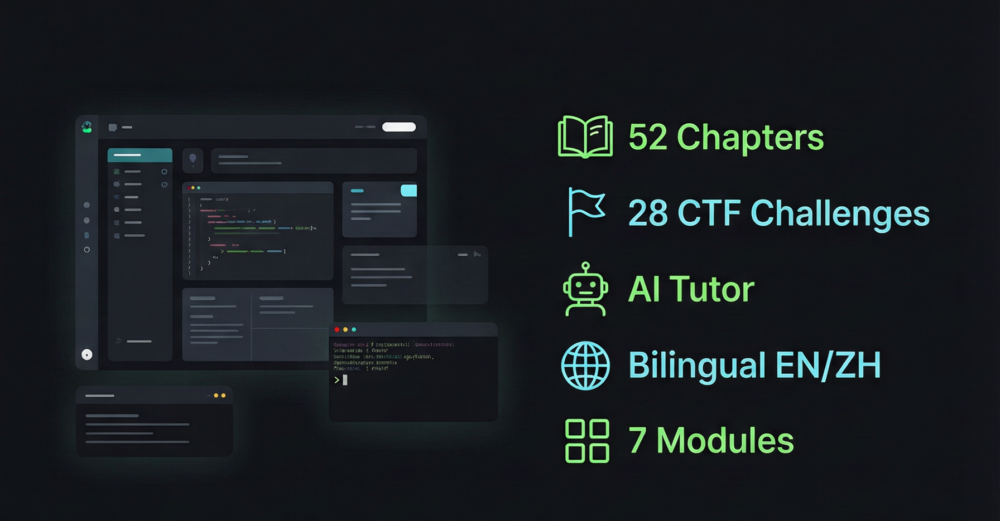

<p align="center">
  
</p>

<h1 align="center">CyberEdu — 网络安全学习平台</h1>

<p align="center">
  一个交互式网络安全学习网站，从零基础到高级渗透，全面覆盖。<br>
  <strong>52 个章节 · 28 道 CTF 挑战 · 中英双语 · AI 导师</strong>
</p>

<p align="center">
  
  
  
  
  
  
</p>

<p align="center">
  <a href="https://chhhhhhhhhhhhhhh.github.io/cyberedu/">🚀 在线体验</a>
  &nbsp;·&nbsp;
  <a href="README.md">English</a>
  &nbsp;·&nbsp;
  <a href="versions/CHANGELOG.md">更新日志</a>
  &nbsp;·&nbsp;
  <a href="https://github.com/Chhhhhhhhhhhhhhh/cyberedu/issues/new/choose">反馈问题</a>
</p>

---

## ✨ 功能特色

<p align="center">
  
</p>

| 分类 | 详情 |
|------|------|
| 📚 **内容体系** | 7 大模块 · 52 个章节 · 4 级难度（零基础 → 高级） |
| 🌐 **中英双语** | 全部章节完整英文翻译 · UI 一键切换 |
| 🤖 **AI 导师** | 内置聊天助手 · SSE 流式输出 · 支持 DeepSeek/OpenAI/通义/Claude/Ollama |
| 💻 **代码编辑器** | CodeMirror 5 · Python / JS / C / Bash 语法高亮 |
| 🚩 **CTF 竞技场** | 28 道挑战 · 密码学、Web、Misc、逆向、取证、PWN |
| ⌨️ **编程练习** | 10 道编程题 · 期望输出自动验证 |
| 🔍 **全局搜索** | Ctrl+K 快速搜索 · 分词模糊匹配 |
| 📱 **响应式设计** | 完整移动端支持 · 侧边栏覆盖 · 紧凑导航 |
| 🌙 **主题切换** | 深色/浅色模式 · 状态持久保存 |
| 📊 **进度追踪** | 自动记录学习进度 · JSON 导出/导入备份 |

### 📚 7 大核心模块

```
编程基础 · 网络 · 密码学 · Web 安全 · 渗透测试 · 恶意软件分析 · CTF 实战
```

## 🏗️ 项目结构

```
cyberedu/
├── cyberedu.html          # 主页面（入口）
├── content.js             # 内容数据（中英双语：模块/章节/练习/CTF）
├── script.js              # 交互逻辑
├── style.css              # 样式表（新粗野主义终端风格）
├── i18n.js                # 中英文切换系统（~140 翻译键值对）
├── server.js              # 本地 Node.js 服务器（仅绑定 127.0.0.1：AI 代理 / CTF 校验 / 限流）
├── flags-hash.js          # CTF 答案 SHA-256 摘要 —— 仓库中不含明文答案
├── favicon.svg            # 站点图标
├── tests/                 # 零依赖测试套件（95 项检查）
├── scripts/               # 维护工具（gen-flag-hashes.js 轮转答案摘要）
├── docs/                  # 文档资源（截图、OG 图片）
├── versions/              # CHANGELOG
├── .github/               # Issue 模板 + CI 工作流
├── SECURITY.md            # 安全策略与漏洞报告通道
└── CONTRIBUTING.md        # 贡献指南
```

## 🚀 使用方式

### 方式一：纯静态浏览（无需服务器）

直接在浏览器中打开 `cyberedu.html` 即可。代码高亮、主题切换、进度管理、搜索等功能正常使用。

### 方式二：本地服务器（启用 AI 导师 + 代码执行）

需要 [Node.js](https://nodejs.org/) v16+：

```bash
node server.js
# 然后浏览器访问 http://localhost:8000
```

服务器默认**只绑定 `127.0.0.1`**（绝不暴露局域网），并对 `Host` 头做白名单校验以防 DNS 重绑定；全站不发放任何 CORS 授权——你浏览器里打开的其他网页无法驱动本服务的任何接口。可用环境变量覆盖：`CYBEREDU_PORT` / `CYBEREDU_HOST` / `CYBEREDU_NO_OPEN=1`。

点击右下角绿色悬浮按钮打开 AI 聊天面板，点击 ⚙ 配置：

| 字段 | 示例 |
|------|------|
| API 类型 | `OpenAI 兼容` 或 `Anthropic` |
| API Base URL | `https://api.deepseek.com` |
| API Key | `sk-...` |
| 模型 | `deepseek-chat`、`deepseek-reasoner`、`claude-sonnet-4-20250514` |

可选：调整温度、最大 Token 数、是否启用思考/推理模式。

> 💡 Windows 用户可双击 `restart_server.bat` 快速重启服务器。

## 🤖 支持的 AI 模型

| 提供商 | API Base URL | 模型示例 |
|--------|-------------|---------|
| **OpenAI 兼容** |||
| DeepSeek | `https://api.deepseek.com` | `deepseek-chat`, `deepseek-reasoner` |
| OpenAI | `https://api.openai.com/v1` | `gpt-4o`, `gpt-4o-mini` |
| 通义千问 | `https://dashscope.aliyuncs.com/compatible-mode/v1` | `qwen-plus`, `qwen-max` |
| Ollama（本地） | `http://localhost:11434` | `llama3`, `qwen2` |
| Groq | `https://api.groq.com/openai/v1` | `llama-3.1-70b` |
| **Anthropic** |||
| Claude | `https://api.anthropic.com` | `claude-sonnet-4-20250514`, `claude-haiku-3-5` |

## 🛠️ 技术栈

| 层级 | 技术 |
|------|------|
| 前端 | HTML5 / CSS3 / 原生 JavaScript（客户端零依赖） |
| 代码高亮 | [Prism.js](https://prismjs.com/) v1.29.0 |
| 代码编辑器 | [CodeMirror 5](https://codemirror.net/)（Python/JS/C/Bash） |
| 本地服务器 | Node.js 内置 `http` 模块（零依赖） |
| 答案校验 | 仅存 SHA-256 摘要（`flags-hash.js`）——仓库不含明文答案 |
| AI 流式输出 | SSE（Server-Sent Events） |
| 字体 | JetBrains Mono + Noto Sans SC + Space Mono |

## 📋 更新日志

### v2.6（2026-08-27）

- 🔒 **服务器仅回环监听** — 默认绑定 `127.0.0.1`，代码执行接口不再暴露给局域网
- 🛡️ **DNS 重绑定防护** — `Host` 头白名单校验，陌生来源一律 403
- 🚫 **彻底移除 CORS 授权** — 站点本就同源自托管，第三方网页再也无法跨站驱动 `/api/run`、AI 代理或进度存储
- 🔑 **答案端到端哈希化** — CTF 校验改为比对 SHA-256 摘要（`flags-hash.js`），仓库与服务端均不再存在明文答案表；离线提交 Flag 同时恢复可用
- 📦 **静态文件黑名单** — `server.js`、`.git/`、测试与脚本目录无法再被 HTTP 直接下载
- ⚡ **性能** — gzip 结果缓存（多 MB 资源零重复压缩）、异步 stat+read 消除 TOCTOU、限流器无条件周期清理、各接口独立的请求体积上限
- 🧾 **CSP** 以 HTTP 响应头 + HTML meta 双通道下发（GitHub Pages 部署同等生效；按零构建内联事件架构放行内联处理器）
- ♻️ 移除已废弃的 `X-XSS-Protection`；修复 Issue 模板文件名兼容性；`restart_server.bat` 便携化（不再硬编码个人路径）；新增 CI 工作流在 Node 18/20/22 上运行测试

> 📋 [查看完整版本历史 →](versions/CHANGELOG.md)

## 🤝 参与贡献

欢迎贡献代码！提交 PR 前请先阅读 [CONTRIBUTING.md](CONTRIBUTING.md)。

## 💬 反馈建议

发现 Bug 或有改进建议？[提交 Issue →](https://github.com/Chhhhhhhhhhhhhhh/cyberedu/issues/new/choose)

## 📄 许可证

[MIT](LICENSE) — 个人和商业使用免费。

---

<p align="center">
  <strong>如果 CyberEdu 对你有帮助，请给个 ⭐ 支持一下！</strong>
</p>
